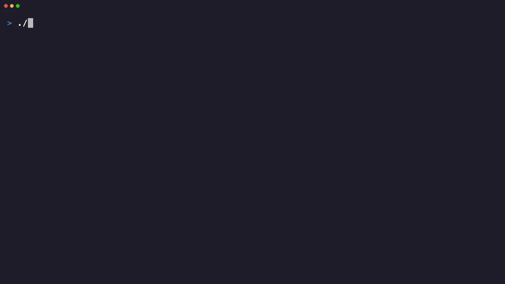

# Aion GGUF Tools

Tools for converting a local Aion-1.0-Instruct Edge ONNX bundle into GGUF and running it with llama.cpp.



Real Aion Q4_K_M GGUF generation through llama.cpp/Metal on an M4 Max, with decode throughput above 200 tokens/s.

This repo contains only converter, validation, and runner scripts. It does not include model weights, tokenizer files, generated GGUF files, ONNX files, safetensors, or any Aion model data.

## Get The Aion Bundle

Microsoft announced the Aion-1.0-Instruct developer preview for Edge Canary and Dev here:

https://blogs.windows.com/msedgedev/2026/06/02/expanding-on-device-ai-in-microsoft-edge-new-models-and-apis-for-the-web/

To get access to the model today, install Microsoft Edge Canary or Dev and use the Aion Prompt API docs/playground path from the announcement so Edge downloads the local ONNX/external-data bundle. The bundle directory should contain files such as:

```text
model.onnx
model.onnx.data
genai_config.json
tokenizer.json
tokenizer_config.json
```

## Requirements

- macOS with Python 3.11+
- A local llama.cpp checkout built with Metal support
- The local Aion Edge ONNX bundle

Example setup:

```sh
python -m venv .venv
source .venv/bin/activate
pip install -r requirements.txt

# sibling checkout is used by default; override with LLAMA_CPP_DIR if needed
git clone https://github.com/ggml-org/llama.cpp ../llama.cpp
cmake -S ../llama.cpp -B ../llama.cpp/build -DGGML_METAL=ON
cmake --build ../llama.cpp/build --config Release -j
```

## Convert To GGUF

```sh
python scripts/convert_aion_onnx_to_gguf.py /path/to/aion-onnx-bundle --outfile /tmp/aion-q40.gguf
```

This directly repacks the ONNX 4-bit quantized weights into GGUF Q4_0 block format — no dequantization, no precision loss. The output is comparable in size to the original ONNX bundle (~1.3 GB).

Options:

```sh
# Smoke test with only the first 2 layers
python scripts/convert_aion_onnx_to_gguf.py /path/to/aion-onnx-bundle --outfile /tmp/aion-q40.gguf --max-layers 2 --verbose
```

## Validate

```sh
python scripts/aion_validate_gguf.py \
  --model-dir /path/to/aion-onnx-bundle \
  --gguf /tmp/aion-q40.gguf \
  --allow-quantized
```

The validation harness checks GGUF metadata, tokenizer/template equivalence, llama.cpp Jinja rendering, ONNX-vs-llama.cpp top logits, deterministic generation, and benchmark speed.

## Run A Demo

```sh
scripts/aion_demo.sh "Write one sentence about Apple Silicon."
```

Defaults:

- `AION_GGUF=/tmp/aion-q40.gguf`
- `LLAMA_CPP_DIR=../llama.cpp`
- `AION_CTX=2048`
- `AION_THREADS=8`
- `AION_MAX_TOKENS=128`
- `AION_TEMP=0.2`
- `AION_TOP_P=0.95`

Use a different model or full context:

```sh
AION_GGUF=/tmp/aion-q40.gguf scripts/aion_demo.sh "Hello"
AION_CTX=8192 scripts/aion_demo.sh "Use the full context limit."
```

## Notes

See [docs/AION_DEMO.md](docs/AION_DEMO.md) for benchmark numbers, prompt-format notes, and fallback commands.
